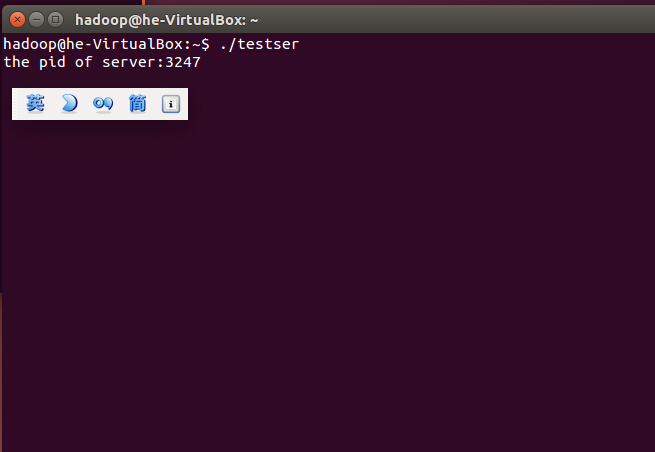
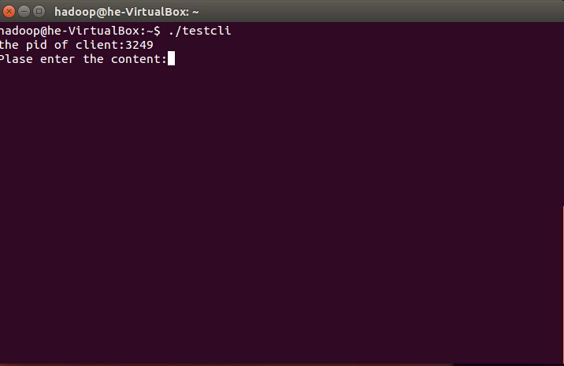
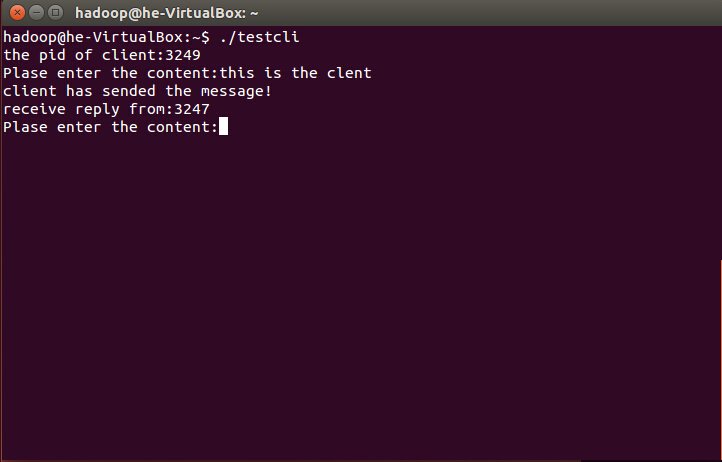
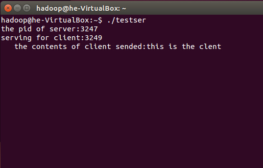
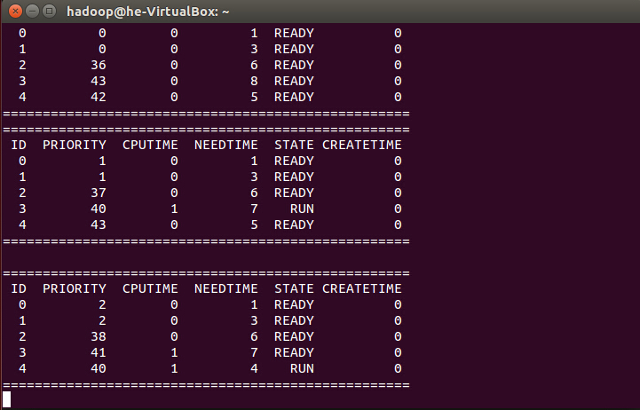
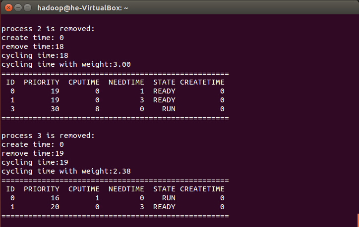
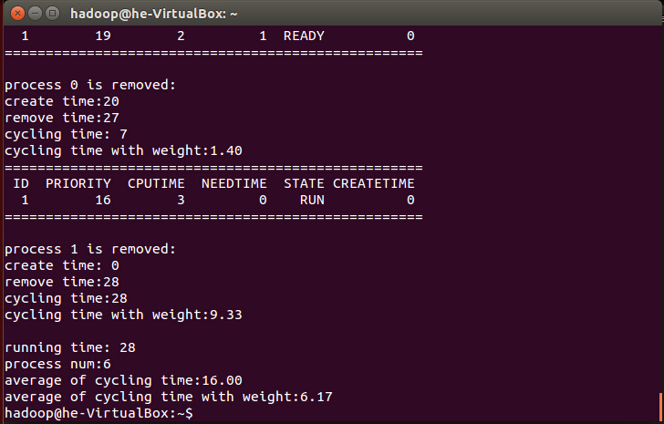
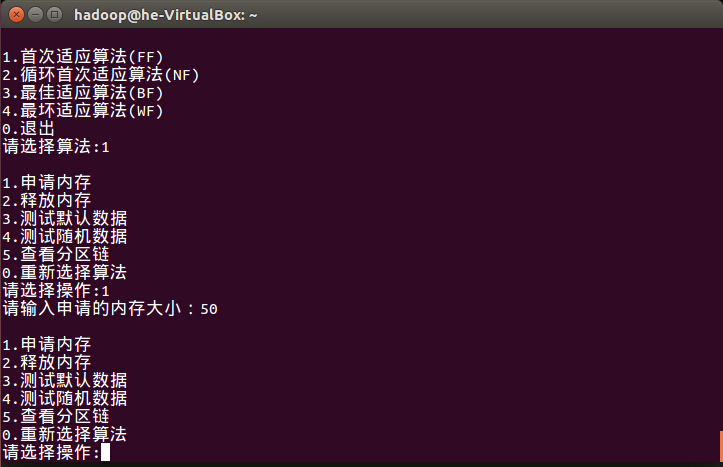
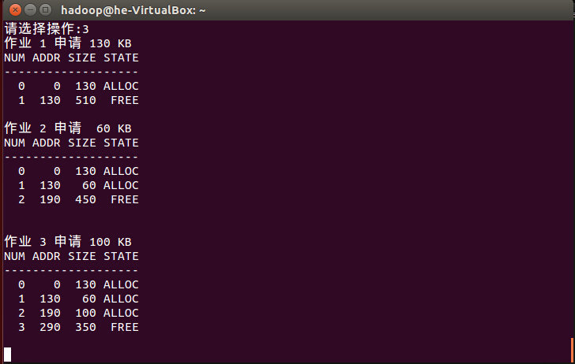

操作系统原理实验
========

* `a3.2`:进程间通信，采用无名管道进行父子进程间的通信
* `client.c` `server.c`:进程间通信，采用消息队列通信机制实现无亲缘进程的通信
* `a4`:动态优先级进程调度模拟
* `a5`:动态分区分配模拟
* 文件均为`UTF-8`编码，第三个实验需要用到管道和消息队列等，必须在`Linux下`编译运行，在`Windows`会报错

效果展示：
--------
### Client & Server

开启服务器，等待客户端请求连接(此服务器pid为3247)

开启客户端，通过消息队列向服务器发送消息(此客户端pid为3249)

输入内容"this is the client"将此消息发送给服务器，提示成功发送并从pid为3247的服务器得到响应(如果同时开着多个server则情况会有所不同)

输出从client中得到的pid与内容content.

### A4

### A5

测试操作：首次适应算法的默认数据测试

## [返回顶部](#操作系统原理实验)
